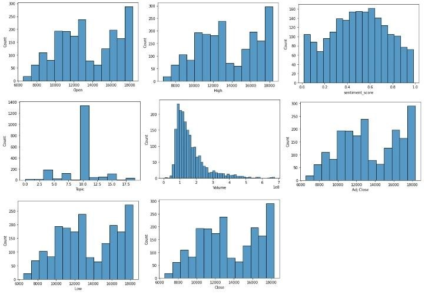

# Predict Stock Price With News Headlines
A project of my text mining course. 
## Purpose 
This project is working to use text mining and time series to detect the connection between the news and the movement of the stock market. Two tasks are included in this project: one is to find out the way of news affecting the stock price rise and fall by machine learning and deep learning; the other is to create a time series forecasting model to predict the stock price in the next 100 days
## Data description
Obtain data from Kaggle: https://www.kaggle.com/aaron7sun/stocknews

## Exploratory Data Analysis
1. Data distribution

2. Decomposition 

## Methodology
1. Preprocessing and Cleaning

2. Feature Extraction

    2.1 Sentiment Analysis by LSTM 
    
       2.1.1 Use IMDB Movie Reviews dataset to train the model
       2.1.2 Use the Glove pre-trained embeddings

    2.2 Generate SVDs by SAS miner 

    2.3 Latent Dirichlet Allocation(LDA) 

3. Term Frequenct & Word Cloud

4. Machine Learning Algorithms

5. Deep Learning Architecture 

7. Stock Price Forecasting By Time Series Analysis 

6. Conclusions 

## Reference
1. Blei, D.M., A.Y. Ng, and M.I. Jordan, Latent dirichlet allocation. Journal of machine Learning research, 2003/1/3: p. 993-1022.

2. Marcelo Beckmann, “Stock Price Change Prediction Using News Text Mining”, 2017/01/24 

3. Sharpe, William F. “The Arithmetic of Active Management” 

4. Ekanshi Gupta; Preetibedi; Poonamlakra, Efficient Market Hypothesis V/S Behavioural Finance 

5. Kavita Ganesan / Hands-On NLP, Text Mining,Tutorial: Extracting Keywords with TF-IDF and Python’s Scikit-Learn

6. Anwar Ur Rehman1 & Ahmad Kamran Malik1 & Basit Raza1 & Waqar Al, A Hybrid CNNLSTM Model for Improving Accuracy of Movie Reviews Sentiment Analysis, 2019/5/17

7. Usman Malik, Python for NLP: Movie Sentiment Analysis using Deep Learning in Keras 9. GloVe: Global Vectors for Word Representation
